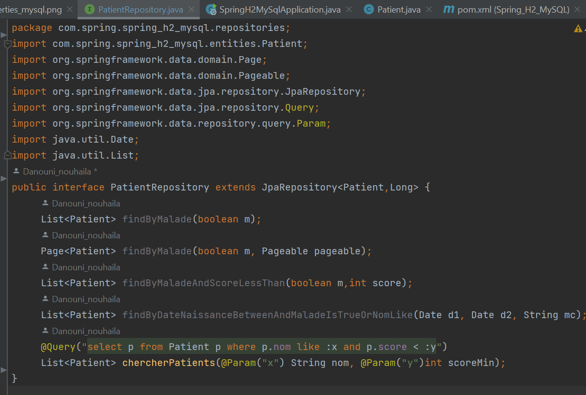
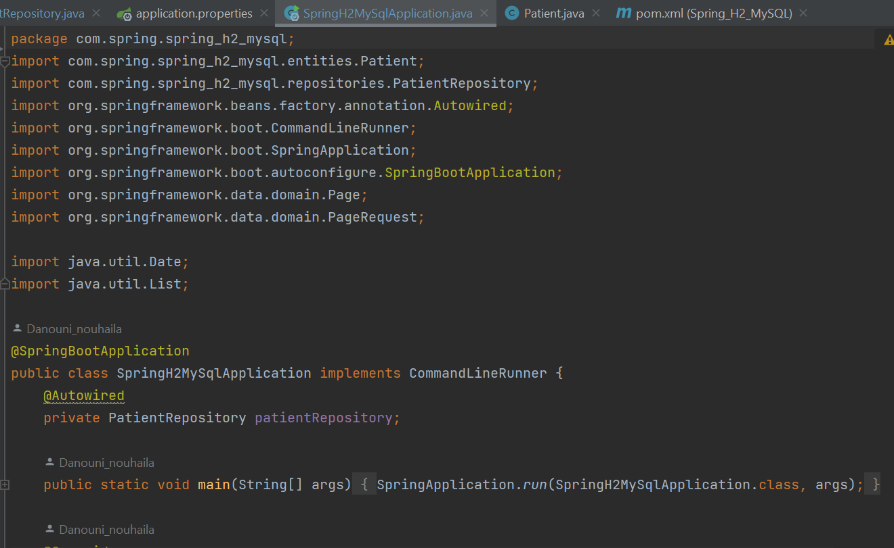
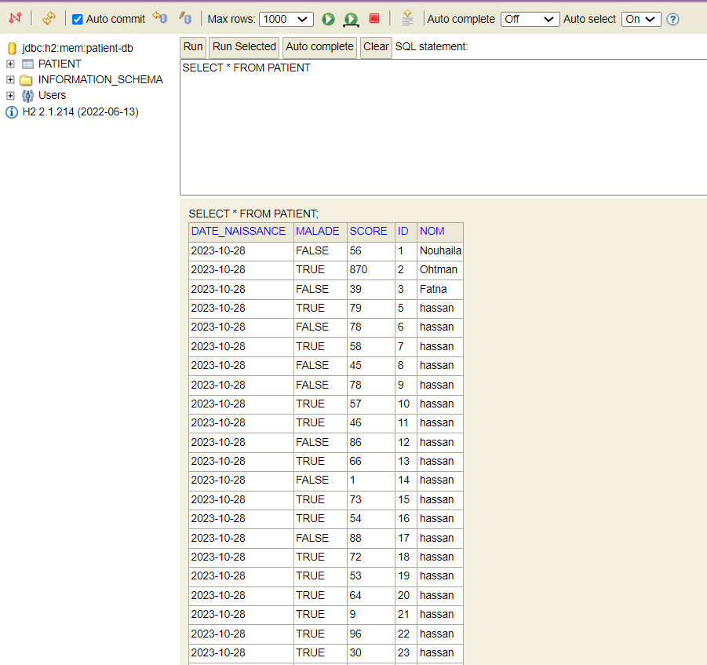

<h2>Introduction</h2>

Dans le monde du développement d'applications, la gestion efficace de la persistance des données est un pilier fondamental. Différentes technologies et approches ont évolué pour répondre à ce défi, allant de l'ORM (Object-Relational Mapping) au JDBC (Java Database Connectivity), en passant par des cadres tels que JPA (Java Persistence API), Hibernate et Spring Data. Ces technologies ont révolutionné la façon dont les développeurs interagissent avec les bases de données, en offrant des solutions robustes et flexibles pour la persistance des données.
 
Ce travail pratique se concentre sur une exploration approfondie de ces concepts essentiels, mettant en évidence leur rôle central dans le développement d'applications Java. Nous avons examiné les différentes couches de l'architecture de persistance, depuis l'accès aux bases de données avec JDBC jusqu'à l'utilisation de JPA pour simplifier la gestion des objets persistants. De plus, nous avons exploré Hibernate, un framework ORM populaire qui facilite la liaison entre les objets Java et les bases de données relationnelles.
 
Enfin, nous avons abordé Spring Data, un composant puissant du framework Spring, qui simplifie encore davantage la gestion des données en fournissant une interface cohérente et flexible pour la persistance. Notre objectif est de mettre en lumière les avantages, les fonctionnalités clés et les scénarios d'utilisation de ces technologies, tout en illustrant comment elles peuvent être mises en œuvre de manière pratique.

<h2>Énoncé</h2>
<ol>
  <li>Installer IntelliJ Ultimate</li>
  <li>Créer un projet Spring Initializer avec les dépendances JPA,H2,Spring Web et Lombok</li>
  <li>Créer l'entité JPA Patient ayant les attributs :</li>
  <ul>
    <li>id de type Long</li>
    <li>nom de type String</li>
    <li>date de naissance de type Date</li>
    <li>malade de type boolean</li>
    <li>score de type int</li>
  </ul>
  <li>Configurer l'unité de persistance dans le fichier application.properties</li>
  <li>Créer l'interface JPA Repository basée sur Spring Data</li>
  <li>Tester quelques opérations de gestion</li>
  <ul>
    <li>Ajouter des patients</li>
    <li>Consulter tous les patients</li>
    <li>Chercher un patient par Id</li>
    <li>Mettre à jour un patient</li>
    <li>supprimer un patient</li>
  </ul>
  <li>Migrer de h2 Database vers MySQL</li>
</ol>
<h2>Étapes du TP</h2>
<ol>
  <li>Installation d'IntelliJ Ultimate</li>
  

  La première étape de ce travail pratique consiste à procéder à l'installation d'IntelliJ IDEA Ultimate, un environnement de développement intégré (IDE) de grande puissance, qui servira de plateforme pour le développement de notre application.
  

  <li>Création d'un Projet Spring Initializer avec Maven en ajoutant aussi les dépendances suivantes</li>
  <ul>
    <li>Spring Data JPA</li>
    <li>H2 Database (base de données en mémoire)</li>
    <li>Spring Web (pour les contrôleurs web)</li>
    <li>Lombok (pour la génération automatique de code)</li>
    <li>MySQL Driver</li>
    <li>Thymeleaf</li>
  </ul>
  <li>Création de l'Entité JPA Patient</li>

Voici les attributs de cette entité:

<ul>
    <li>id de type Long</li>
    <li>nom de type String</li>
    <li>date de naissance de type Date</li>
    <li>malade de type boolean</li>
    <li>score de type int</li>
  </ul>
 

  <li>Configuration de l'unité de persistance dans le fichier application.properties pour utiliser H2 Databease</li>

Ces lignes de configuration définissent l'URL de la base de données (H2 en mémoire), activent la console H2 pour une gestion interactive, et spécifient le port (8082) sur lequel l'application sera accessible.

  

  <li>Création de l'interface JPA Repository basée sur Spring Data</li>

Cette interface "PatientRepository" étend "JpaRepository" pour gérer l'accès aux données de l'entité "Patient". Il fournit des méthodes pour rechercher des patients par différents critères, notamment le statut de maladie, le score, la date de naissance et le nom, ainsi qu'une requête personnalisée pour la recherche.

  

<li>Tests des Opérations de Gestion</li>
<ul>
    <li>Le point d'entrée de l'application Spring Boot</li>

    <li>Ajouter des patients</li>

    <li>Consulter tous les patients</li>

<li>Chercher des patients selon des critéres</li>

    <li>Chercher un patient par Id</li>

    <li>Mettre à jour un patient</li>

    <li>Supprimer un patient</li>

    <li>Exécution avec H2 Database</li>

<li> les données dans H2 Database</li>

</ul>

<li>Migration de H2 Database vers MySQL</li>

<ul>
<li>Configuration de l'unité de persistance dans le fichier application.properties pour utiliser MySQL</li>

<li>Exécution avec MySQL</li>

<li> les données dans My SQL</li>

</ul>

<h2>Conclusion</h2>

Ce travail pratique a plongé dans l'univers complexe de la gestion de la persistance des données en utilisant des technologies essentielles telles que l'ORM, le JDBC, le JPA, Hibernate et Spring Data. Notre exploration a permis de découvrir comment ces outils puissants simplifient la tâche des développeurs lors de la création d'applications Java robustes et évolutives.
 
Il a également souligné l'importance de choisir les bons outils pour gérer la persistance des données en fonction des besoins spécifiques du projet. L'apprentissage de ces concepts et de leur mise en œuvre pratique constitue un atout essentiel pour les développeurs en quête d'efficacité, de performance et de fiabilité dans leurs applications.
 
En conclusion, cette exploration a élargi notre compréhension des technologies de gestion de la persistance des données, ouvrant la voie à des projets plus avancés et à une expertise accrue dans le développement d'applications Java. Elle témoigne de l'importance de ces outils dans le paysage du développement logiciel moderne, où la gestion des données est cruciale pour le succès des projets.

</ol>

